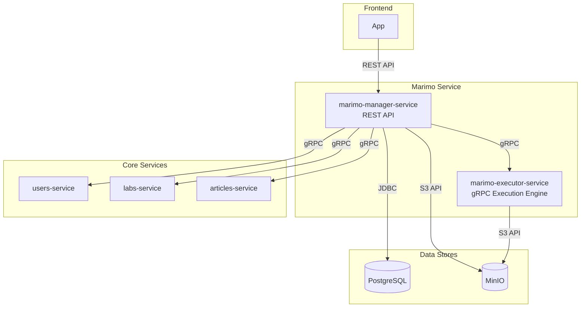

# Marimo Service Documentation

## 1. Description and Purpose

The **Marimo Service** is a stateful microservice designed to provide an interactive, real-time code execution environment within the Open Labs Share platform. It enables users to create, manage, and execute scientific notebooks powered by the [marimo](https://github.com/marimo-team/marimo) library.

The service is architected as a dual-component system:
- **Marimo Java Service**: A Java/Spring Boot application that provides a REST API for the frontend. It manages orchestration, persistence, and communication with other backend services.
- **Marimo Python Service**: A Python gRPC service that acts as the execution engine. It manages the lifecycle of marimo notebooks and executes code in isolated user sessions.

This separation was made to separate metadata of marimo components and connections of it with other backend entites (users, labs, articles) from execution of native Python code since marimo uses exactly its syntax.

## 2. Architecture

### System Diagram

### Components

- **Marimo Java Service (Orchestrator)**:
  - Exposes a REST API for clients (e.g., the frontend).
  - Handles all business logic related to components, sessions, and assets.
  - Validates user and content ownership by communicating with `users-service`, `labs-service`, and `articles-service`.
  - Stores all metadata (components, sessions, assets) in a PostgreSQL database.
  - Stores notebook files and user-uploaded assets in MinIO.
  - Communicates with the Python service via gRPC to manage execution sessions and run code.

- **Marimo Python Service (Executor)**:
  - Exposes a gRPC API for the Java service.
  - Manages a pool of `marimo` kernel processes.
  - Handles the lifecycle of interactive sessions (`start`, `execute`, `end`).
  - Reads notebook files directly from MinIO to initialize sessions.
  - Returns execution results, outputs, and errors to the Java service.

### Data Storage

- **PostgreSQL**: The primary database for storing all metadata related to the Marimo service, including:
  - `components`: Information about each notebook, its owner, and its link to other content.
  - `component_sessions`: Active and inactive user sessions for each component.
  - `component_assets`: Metadata about user-uploaded files (e.g., datasets).
  - `execution_history`: A history of executed code cells within sessions.
  - `widget_state`: Current state and values of interactive widgets within sessions.

- **MinIO**: Object storage used for file-based data. The service uses a single bucket (defaulting to `marimo`) and organizes files within it using path prefixes:
  - `marimo/components/{component-id}/notebook.py`: Stores the actual `.py` notebook files.
  - `marimo/components/{component-id}/assets/...`: Stores user-uploaded assets for use within notebooks.

## 3. Business Logic

### Core Services

- **ComponentService**: Manages the CRUD operations for Marimo components (notebooks). Ensures that the `owner_id` and `content_id` are valid by querying other microservices.
- **SessionService**: Handles the lifecycle of user sessions. Starts, stops, and retrieves the status of interactive sessions by calling the Python service.
- **ExecutionService**: Orchestrates code execution requests, forwarding them to the appropriate session in the Python service and recording the results.
- **AssetService**: Manages the upload, download, and deletion of user assets associated with a component.

## 4. API

### REST API (Provided by Java Service)

The Java service exposes a RESTful API for the frontend. All endpoints are rooted under `/api/v1/marimo`.

**Key Endpoints:**
- `POST /components`: Create a new notebook component.
- `GET /components/{id}`: Retrieve a component's details.
- `POST /sessions`: Start a new interactive session for a component.
- `GET /sessions/{id}`: Get the status of a session.
- `POST /sessions/{id}/execute`: Execute a code cell within a session.
- `POST /components/{id}/assets`: Upload an asset for a component.

### gRPC API (Internal, Python Service)

The Python service exposes a gRPC API for internal use by the Java service.

**Key RPCs:**
- `StartSession`: Initializes a new marimo kernel and loads a notebook.
- `ExecuteCell`: Runs code within an existing session.
- `EndSession`: Shuts down a marimo kernel and cleans up resources.
- `GetSessionState`: Retrieves the current state (e.g., variables) from a running session.

## 5. gRPC Integration with Other Services

The `marimo-manager-service` acts as a gRPC client to other core services for validation purposes.

- **`users-service`**: Used to validate that the `owner_id` provided during component creation corresponds to an existing user.
- **`labs-service`**: Used to validate that the `content_id` (for `content_type: "lab"`) corresponds to an existing lab.
- **`articles-service`**: Used to validate that the `content_id` (for `content_type: "article"`) corresponds to an existing article.

## 6. Environment Configuration

### Marimo Java Service (`application.yml`)

| Variable                        | Description                                     | Default                   |
|---------------------------------|-------------------------------------------------|---------------------------|
| `SERVER_PORT`                   | HTTP port for the REST API.                     | `8084`                    |
| `DB_URL`                        | PostgreSQL connection URL.                      | `jdbc:postgresql://localhost:5432/marimo_service`   |
| `DB_USERNAME` / `DB_PASSWORD`   | Database credentials.                           | `postgres` / `postgres`   |
| `MINIO_ENDPOINT`                | MinIO connection endpoint.                      | `http://localhost:9000`   |
| `MINIO_ROOT_USER` / `MINIO_ROOT_PASSWORD` | MinIO connection credentials.         | `minioadmin` / `minioadmin` |
| `MINIO_BUCKET`                  | MinIO bucket name.                              | `marimo`                  |
| `PYTHON_SERVICE_HOST`           | Hostname of the Python gRPC service.            | `marimo-executor-service`   |
| `PYTHON_SERVICE_PORT`           | Port of the Python gRPC service.                | `9095`                    |
| `USERS_SERVICE_HOST/PORT`       | `users-service` gRPC location.                  | `users-service:9093`      |
| `LABS_SERVICE_HOST/PORT`        | `labs-service` gRPC location.                   | `labs-service:9091`       |
| `ARTICLES_SERVICE_HOST/PORT`    | `articles-service` gRPC location.               | `articles-service:50051`  |
| `AUTH_SERVICE_HOST/PORT`        | `auth-service` gRPC location.                   | `auth-service:9092`       |

### Marimo Python Service

| Variable                | Description                       | Default                 |
|-------------------------|-----------------------------------|-------------------------|
| `GRPC_PORT`             | Port for the internal gRPC server.| `9095`                  |
| `MINIO_ENDPOINT`        | MinIO endpoint URL.               | `localhost:9000`        |
| `MINIO_ACCESS_KEY`      | MinIO access key.                 | `minioadmin`            |
| `MINIO_SECRET_KEY`      | MinIO secret key.                 | `minioadmin`            |
| `MINIO_BUCKET`          | Bucket for notebook files.        | `marimo`                | 